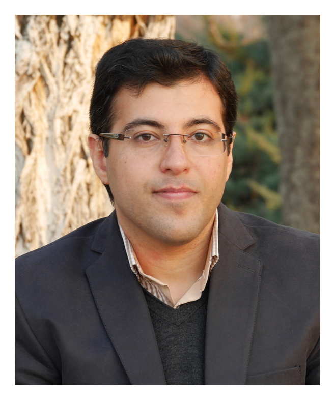

# Salman Beigi

###### Home&nbsp;         [Manuscripts](manuscripts.html)&nbsp;         [Lecture notes](lecturenotes.html)

 

Full professor 

School of Mathematics     
Institute for Research in Fundamental Sciences (IPM)  
Niavaran Sq.   
Tehran, Iran  
P. O. Box 19395-5746  
salman.beigi[at]gmail[dot]com  
 &nbsp;&nbsp;&nbsp;

I am a faculty member of [School of Mathematics](http://math.ipm.ir/), [Institute for Research in Fundamental Science (IPM)](http://ipm.ir/).  I received Ph.D. from the [Department of Mathematics](http://math.mit.edu/) of [MIT](http://mit.edu/) in 2009 under the supervision of [Peter Shor](http://math.mit.edu/~shor/). Before joining IPM, I was a postdoc at [Institute for Quantum Information](http://www.iqim.caltech.edu/) at [Caltech](http://www.caltech.edu/).	
&nbsp;

My main field of research is quantum information theory. I am interested in various topics in this field including quantum complexity theory, quantum algorithms, quantum error-correcting codes, foundations of quantum physics, quantum Shannon theory and quantum machine learning.

I am a member of the Editorial Advisory Board of the [Journal of Mathematical Physics](https://aip.scitation.org/journal/jmp).

Here is my [CV](files/cv.pdf), and my publication lists can be found on [arXiv](http://arxiv.org/find/all/1/au:+beigi_salman/0/1/0/all/0/1) and [Google Scholar](https://scholar.google.com/citations?user=h2hT0XcAAAAJ&hl=en).

